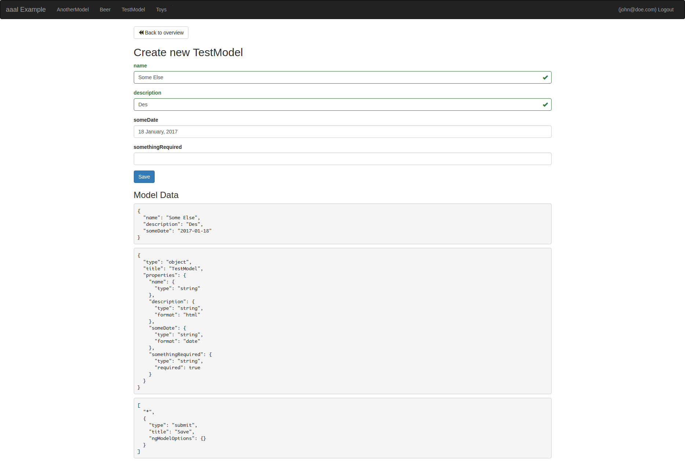
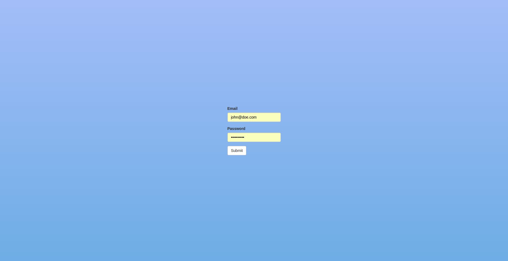
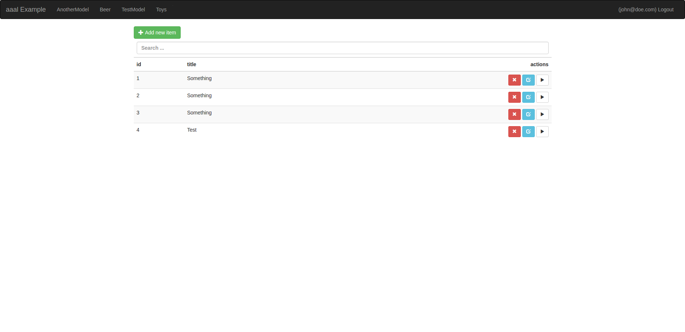

# generator aaal (angular auto admin loopback)
`generator-aaal` is a Yeoman generator, which provides you with a angular based crud-interface with is automatically created based on your model definitions. You can drop it in in your existing loopback app, even drop it in your existing angular frontend app. 

The interface `generator-aaal` provides relies heavily on [angular schema forms](http://schemaform.io/). So if you want to customize your forms, you might want [to have a look at their docs](https://github.com/json-schema-form/angular-schema-form/blob/master/docs/index.md).





## getting started
[Check out the pre built example](https://github.com/johannesjo/angular-auto-admin-looopback)! 

## manually building a new app
1. [Create loopback app](http://loopback.io/getting-started/) for your api if not done so and create some models

        ```
        npm install -g strongloop bower yo
        slc loopback  # choose version 2.x and 'api-server'
        slc loopback:model yourFirstModel
        ```

2. Install generators 

        ```
        npm install -g generator-moda generator-aaal
        ```

3. Create basic front-end via [generator-moda](https://github.com/johannesjo/generator-modular-angular)

        ```
        cd client
        # create .yo-rc.json for the frontend if not present
        echo "{}" > .yo-rc.json
        yo moda my-admin
        ```
 Choose `ui-router.js` and `angular-resource` from modules. Everything else is optional.
        
4. Cancel gulp and drop in the aaal components

        ```
        # install bower deps
        bower install -S ngtoast angular-schema-form angular-smart-table ui.bootstrap ngstorage angular-schema-form-datepicker angular-schema-form-tinymce bootstrap-css-only
        # drop in aaal
        yo aaal
        ```
 
5. Make sure jquery (required for the datepicker) is loaded first by adding the following to your bower.json

        ```
          "overrides": {
            "angular": {
              "dependencies": {
                "jquery": "*"
              }
            }
          }
        ```
 
6. Inject frontend files and build css
        
        ```
        gulp injectAll && gulp buildStyles
        ```

7. Update your _app.js (client/app/scripts/_app.js) with the aaap-depdency, e.g.:
        
        ```
        (function() {
            'use strict';
        
            angular
                .module('myAdmin', [
                    'ngAnimate',
                    'ngAria',
                    'ngResource',
                    'ui.router',
                    // insert here or somewhere else
                    'aaal'
          ]);
        })();  
        ```

8. Update the path from which static files are serverd in your server/middleware.json

        ```
         "files": {
            "loopback#static": {
              "params": "$!../client/app"
            }
          }
        ```

9. Run the server
        
        ```
        # cd to server dir
        cd ..
        node  .
        ```

9. Navigate to http://localhost:3000/index.html#/login log yourself in with one of your loopback users and enjoy.

10. (optional) add proxy to access api from gulp serve for development. 

        ```
        # cd to frontend
        cd client
        # install proxy middleware
        npm install -D proxy-middleware
        
        #######################################
        # add the following to the tasks/dev.js
        var proxy = require('proxy-middleware');
        var url = require('url');
        // ...
        gulp.task('browserSync', function() {
            var proxyOptions = url.parse('http://localhost:3000/api');
            proxyOptions.route = '/api';
        
            browserSync({
                server: {
                    baseDir: config.base,
                    livereload: true,
                    middleware: [proxy(proxyOptions)]
                }
            });
        });
        #######################################
        
        # run gulp or gulp serve for dev
        gulp serve
        ```

## rebuilding your aaal backend interface after model changes
Simply run:         
        ```
        yo aaal
        ```

## adding it to your existing angular frontend

1. Install generator
        
        ```
        npm install -g generator-aaal
        ```
        
2. Cd to your frontend directory and run the generator
        
        ```
        yo aaal
        ```
        
3. Cancel gulp and drop in the aaal components
        
        ```
        # install bower deps
        bower install -S ngtoast angular-schema-form angular-smart-table ui.bootstrap ngstorage angular-schema-form-datepicker angular-schema-form-tinymce bootstrap-css-only
        ```
        
4. Inject all the files in your aaal directory and all the bower_components to your index.html.

5. Update your angular module with the aaap-depdency, e.g.:

        ```
        (function() {
            'use strict';
        
            angular
                .module('myAdmin', [
                    'ngAnimate',
                    'ngAria',
                    'ngResource',
                    'ui.router',
                    // insert here or somewhere else
                    'aaal'
          ]);
        })();  
        ```

6. Have fun!


## customizing your forms via form schema definition

It's best to [check out the the examples of angular schema forms](http://schemaform.io/examples/bootstrap-example.html) for this. This can be easily added to the controller definition of the [your-model]-edit-ctrl.js. 

## customizing your forms via model definitions

Out of the box `generator-aaal` supports to declare additional formats for your model properties, you can provide via the format sub-property. Some example:


```
// common/models/another-model.json
{
  "name": "AnotherModel",
  "base": "PersistedModel",
  "properties": {
    "title": {
      "type": "string"
    },
    "description": {
      "type": "string",
      "format": "html" // ==> will be edited in a tinymce editor instance
    },
    "someDate": {
      "type": "date" // ==> will be automatically converted to a date input
    }
}

```
